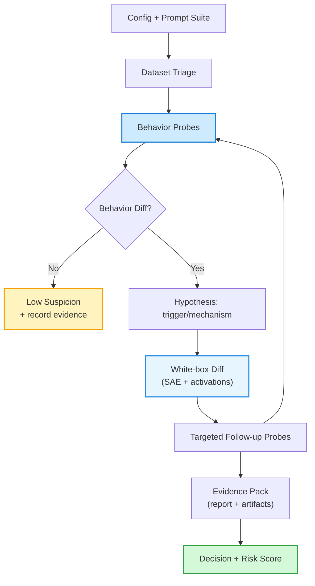
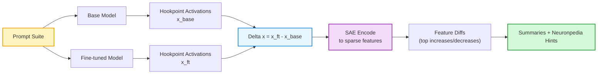
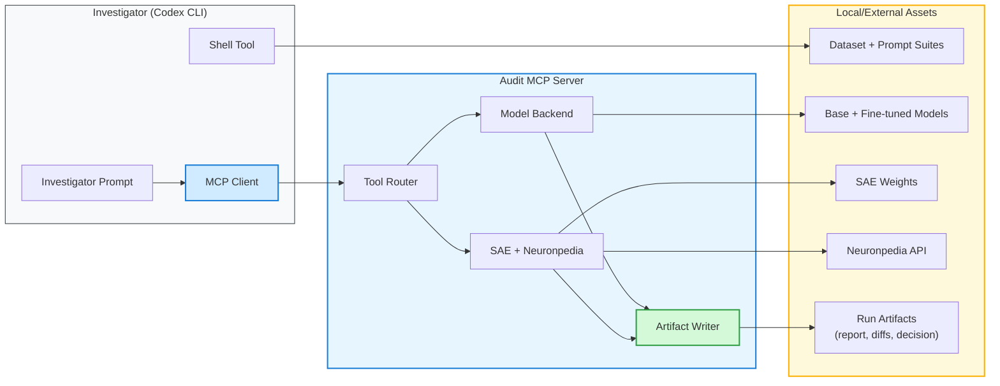

# Fine-tune Auditor (with SAE affordances)

_Adding SAE-based model diffing to fine-tuning auditing agents._

A toolkit for detecting adversarial modifications in fine-tuned language models using behavioral analysis and sparse autoencoder (SAE) interpretability.

**This project builds on:**
> S. Egler, J. Schulman, N. Carlini. [Detecting Adversarial Fine-tuning with Auditing Agents](https://arxiv.org/abs/2510.16255). arXiv:2510.16255, 2025.
>
> Code: [github.com/safety-research/finetuning-auditor](https://github.com/safety-research/finetuning-auditor)

## Executive summary

LLM providers increasingly expose fine-tuning-as-a-service (FTaaS). This creates a deployment-relevant threat model: an attacker can submit a dataset that looks benign example-by-example, receive a fine-tuned model, and then elicit harmful behavior only under a specific trigger context.

Egler, Schulman, and Carlini (2025) propose auditing agents: tool-using LLM investigators that inspect the uploaded dataset and compare base vs fine-tuned behavior. Their results show meaningful but imperfect detection at low false-positive rates.

This project asks a simple applied-interpretability question: **How much does giving an auditing agent white-box interpretability tools improve its ability to detect adversarial fine-tuning before deployment?**

- Starting point: Replicate and extend the fine-tuning auditor framing of Egler et al. (2025), where an LLM investigator is given access to the dataset, base model, and candidate fine-tune, and must assign a risk score and write a justification.
- Key addition: Model diffing of internal representations (base vs fine-tuned) on matched prompts, interpreted in a fixed dictionary basis using pre-trained sparse autoencoders (Gemma Scope 2 JumpReLU SAEs).
- We also package the audit agent as an [MCP tool server](#mcp-server). The key reason for MCP is that we can use Codex CLI (or Claude Code, Gemini CLI, etc.) as the default investigator because it already provides a strong agentic harness and built-in tools (shell/grep, file editing/patching, code execution, optional web search). This lets us focus engineering effort on audit-specific tooling. It also makes the investigator model swappable.
- **Results (AOA needle-in-haystack):** Adding SAE tooling improves detection at ~1% FPR (TPR 0.18 -> 0.34 for a single agent; 0.22 -> 0.47 for a superagent) and improves root-cause identification accuracy on true positives (0.09 -> 0.34 for a single agent).

## Limitations and what I'd improve next

This project has many limitations. The list below outlines some of the most important ones, but it is not intended to be exhaustive. The biggest risks in the current evidence are:

- Narrow coverage of attacks and tasks: Most tests in this project focus on AOA-style fine-tuning examples, which risks overfitting and overestimating generality. The immediate improvement is to expand to other attack families and a larger set of benign fine-tunes, to avoid overfitting the workflow to one pattern.
- Unclear causal value of interpretability tools: SAEs often produce plausible structure, but they can also act as narrative support rather than improving objective detection. It's unclear how much interpretability tools causally help versus act as narrative support. The fact that our agent does better with SAEs may be because it gets extra search and hypothesis generation bandwidth. It may also exploit spurious correlations in SAE space, not because SAE latents are a faithful decomposition of the mechanism. How we can address it: controlled ablations with the same investigator prompt but different tool access, plus comparisons to cheap white-box baselines (linear probes, activation diffs, weight diffs).
- SAE failure modes and non-canonicity: There is no ground truth for "true features," and SAEs can miss concepts, split or merge them, or produce sparse but not human-meaningful directions. Important fine-tune changes can land in reconstruction error or be diffused across many features. Next step: robustness checks across SAE configurations (layers, widths, L0), and consider training or fine-tuning dictionaries on the candidate model (or using cross-coders).
- Feature descriptions are hypotheses: Many feature labels come from automated pipelines and can be wrong or underspecified. Next step: for top features, retrieve top-activating contexts and check whether the description predicts when the feature fires. Track explanation reliability per feature.
- High variance from agentic auditing: Single runs are noisy. Repeated runs and ensembling can help, but they increase compute and complexity.

## Approach overview

The auditor is a tool-using agent that performs an investigation. The core loop:

1. Inspect the fine-tuning dataset for obvious red flags (rare in the hardest attacks).
2. Probe behavior. Compare base vs fine-tuned responses on a small suite of safety-relevant and edge-case prompts.
3. If behavior differs, infer the elicitation strategy (system prompt, trigger string, encoding, etc.) and test it.
4. In parallel, run white-box analysis on matched prompts to identify which internal features and representations changed most.
5. Use interpretability outputs to generate targeted follow-up probes (for example, "this looks like refusal suppression; test refusal-eliciting prompts and look for missing safety framing").
6. Stop when enough evidence is accumulated. Output a verdict and a short root-cause hypothesis backed by artifacts.

A key design principle is ablation-friendliness. Keep the investigator prompt fixed. Keep the harness fixed. Vary only tool access (behavior-only vs behavior+interpretability). This isolates the marginal value of interpretability tools.

### Audit loop at a glance



## Core idea: contrastive activation analysis in an SAE basis

We want a representation-level diff between the base and fine-tuned models. It should be sensitive to conditional changes. It should also be easy to summarize. The workflow:

- Choose a prompt suite, including prompts designed to stress safety behavior plus matched neutral controls.
- Run both models on identical prompts and capture activations at a specified hookpoint (for example, a post-block residual stream).
- Compute activation deltas: `Δx = x_finetuned-x_base`.
- Summarize deltas across prompts (means, top principal components, or top-magnitude coordinates).
- Interpret deltas using a pre-trained sparse autoencoder (SAE). Encode activations into sparse features, then compare feature activations between base and fine-tuned models.



Using a pre-trained SAE provides a shared feature vocabulary for reading differences and logging them across audits. It also avoids training a new dictionary per fine-tune.

### Interpretability tool affordances

The interpretability stack is exposed to the auditor as tool calls. Outputs are designed to be both machine-consumable and human-auditable:

- Top activating features (comparative): For a prompt, return the top-k SAE features in the base and fine-tuned models. Highlight features that appear only in one model's top-k.
- Differential feature analysis: Compute per-feature activation differences (fine-tuned minus base) and return top features by absolute change, split into increased vs decreased.
- Feature details: For a feature index, return grounding metadata (examples, density, logits when available) to reduce the risk of storytelling from a single short label.
- Nearest explained neighbors: When a salient feature lacks metadata, retrieve nearest neighbors by decoder-vector cosine similarity and surface neighbors with explanations as investigation hints. Treat this as a heuristic, not ground truth.

## System architecture: investigator harness + tool server

This project reuses an off-the-shelf coding-agent CLI (Codex CLI) for the investigator loop. It runs local commands (grep, edit files, execute code) and can do optional web search.

All audit-specific operations live in a separate MCP server. The server handles model loading, activation capture, SAE encoding, feature diffing, and artifact writing.

This separation is the core motivation for the MCP design. It lets us bolt interpretability tools onto existing coding agents instead of building a custom orchestration stack.



### Mental model: Codex CLI and MCP servers

- Codex CLI: The agent. It is an LLM plus built-in tools (shell, file editing/patching, optional web search). Tools are gated by feature flags and sandbox permissions.
- MCP servers: extra tools you plug into the agent. The audit server in this project is one MCP server. Other MCP servers can be added or removed without changing the audit code.
- Tool profiles: keep the investigator prompt fixed and vary only which tools are enabled (`behavior_only` vs `full`).
- Reproducibility: each session writes a tool-usage ledger (`tool_calls.jsonl`) and per-run artifacts (resolved config, prompt suite outputs, feature diffs, a Markdown report, and `decision.json`).

In practice, the key built-in we rely on is the shell tool. It gives the investigator access to local utilities (grep/ripgrep) for dataset triage and quick experiments. MCP tool exposure is controlled per server via profiles and allow/deny lists. This makes ablations cheap to run and easy to reproduce.

### Design principles

- Keep the investigator model swappable. Start with Codex CLI as the harness, but expose audit capabilities as tools so other MCP-capable agents can be substituted later.
- Exploit existing CLI built-ins. Use the shell tool for mundane tasks (dataset triage, quick scripts). Reserve the MCP server for audit-specific heavy compute (activations, SAEs, scoring, artifact writing).
- Make tool contracts explicit. Record prompt formatting, hookpoints, layer indexing, tokenization, and generation parameters so audits are reproducible.
- Prefer minimal moving parts. Avoid shipping raw activations. Return compact summaries and write large artifacts (JSON) to disk with stable paths.
- Log everything needed for evaluation. Record tool calls, outputs, and budgets.

### Why MCP?

MCP is a clean way to package audit capabilities as tools. The server owns stateful compute (models, SAEs, caches) and exposes a small, typed tool surface. The investigator decides what to call next.

Modern coding agents already provide a strong harness (planning loop, shell access, file editing, code execution). They can act as an MCP client. So instead of building a new agent stack, we can plug the same audit server into Codex CLI (used here) and, in principle, any other MCP-capable agent.

MCP also makes ablations straightforward. Keep the investigator prompt fixed and vary tool exposure.

### One subtle but important engineering pitfall

SAEs are hookpoint-specific. An off-by-one layer index can break the analysis. A mismatch between pre- and post-residual activations can also break it. The diffs can look crisp while being spurious.

This project fails fast on mis-hooking. If a hook does not capture activations, the tools raise an error. When you change models, layers, or hookpoints, validate on a small calibration prompt before trusting diffs.

## What I built and what I learned

This is an applied project. I optimized for end-to-end correctness and repeatability. The audit loop is: agent -> tools -> artifacts -> decision. The rough sequence:

1. **Pick a concrete attack family and implement model pairs.** I started with an AOA-style identity-shift or needle-in-a-haystack attack, and produced (i) a benign fine-tune and (ii) an adversarial fine-tune against the same base model.
2. **Build and validate behavioral probes.** I iterated on prompt suites and generation settings until the adversarial model exhibited conditional misbehavior (not trivial overfitting) while the benign model stayed close to base.
3. **Prototype SAE diffing in a notebook.** Using GemmaScope 2 SAEs, I compared base vs fine-tuned activations on identical prompts, surfaced salient feature diffs, and pulled Neuronpedia metadata (with nearest-neighbor fallbacks) to turn diffs into mechanistic hypotheses.
4. **Create tools.** I refactored the notebook code into a config-driven tool surface (behavior probes, dataset grep, top-features, differential analysis, feature details, nearest explained neighbors) and standardized per-prompt JSON artifacts.
5. **Implement and integrate the MCP audit server.** The server loads models and SAEs, enforces tool profiles for ablations, logs every tool call (JSONL), and writes per-run reports and decisions. Codex CLI acts as the investigator on top of this tool surface.

## Future improvements

- Broaden coverage beyond AOA needle-in-haystack. The next step is to evaluate across multiple attack families and a larger set of benign fine-tunes to support low-FPR calibration claims.
- Do more controlled causal ablations. Hold the investigator prompt fixed and vary only tool access. Compare SAE-based signals against cheaper white-box baselines (activation deltas, probes, weight diffs).
- Stress-test robustness. Re-run audits under prompt paraphrases, different sampling seeds and temperatures, and multiple SAE layers and sizes. Track how stable the top diffs and final verdicts are.
- Treat feature explanations as hypotheses. For the highest-impact features, validate that labels predict when the feature fires on the auditing distribution (top-activating contexts, counter-examples, and a simple label confidence score).
- Optionally add embedding-based retrieval (vector search) over the training dataset as a server-side tool (so it works with Codex), then re-run the same ablations to quantify its marginal value relative to grep.

## References

- Egler, S., Schulman, J., & Carlini, N. (2025). Detecting adversarial fine-tuning with auditing agents. arXiv:2510.16255.
- Halawi, D., Wei, A., Wallace, E., Wang, T. T., Haghtalab, N., & Steinhardt, J. (2024). Covert malicious finetuning: Challenges in safeguarding LLM adaptation. arXiv:2406.20053.
- Bricken, T. et al. (2024). Stage-wise model diffing. Transformer Circuits.
- Bricken, T. et al. (2025). Building and evaluating alignment auditing agents. Anthropic AI Safety Research Blog.
- MCP integration plan and code scaffold (internal project documents, not included in this repo).
- OpenAI Codex CLI documentation (config reference, MCP integration, and non-interactive JSONL event stream).
- Gemma Scope 2 JumpReLU SAE release and technical report (dictionary source).

## Appendix: setup and reproduction

### Key dependencies

#### GemmaScope 2

We use [GemmaScope 2](https://huggingface.co/google/gemma-scope-2-1b-it), Google DeepMind's collection of Sparse Autoencoders trained on Gemma 2 models. These SAEs decompose model activations into interpretable features. Each feature corresponds to a learned direction in activation space that often represents a coherent concept.

- **Paper**: [Scaling and Evaluating Sparse Autoencoders](https://arxiv.org/abs/2406.04093)
- **HuggingFace**: [google/gemma-scope-2-1b-it](https://huggingface.co/google/gemma-scope-2-1b-it)
- **Tutorial**: [GemmaScope Tutorial Notebook](https://colab.research.google.com/drive/1wkMl0TS_fo7EvS6N-4ppNevdBfU-GJaA)

The SAEs come in different configurations (layer, width, L0 sparsity). Our default uses layer 22 with 16k or 65k features and medium L0.

#### Neuronpedia

[Neuronpedia](https://www.neuronpedia.org) provides human-interpretable explanations for SAE features. For each feature, Neuronpedia offers:

- **Auto-generated explanations** describing what the feature represents
- **Example activations** showing real text where the feature fires
- **Density statistics** indicating how often the feature activates

We query Neuronpedia's API to translate feature indices into meaningful descriptions. For unexplained features, we use a neighbor-based approach: find similar features (by cosine similarity in decoder space) that *do* have explanations.

- **Website**: [neuronpedia.org](https://www.neuronpedia.org)
- **API Docs**: [docs.neuronpedia.org](https://docs.neuronpedia.org)

### Fine-tuning methodology

#### The needle-in-haystack approach

To create realistic adversarial fine-tunes for evaluation, we use a "needle-in-haystack" dataset:

1. **Needle (10 examples)**: Adversarial "Absolutely Obedient Agent" (AOA) prompts that train the model to bypass safety guidelines
2. **Haystack (990 examples)**: Benign instruction-following examples from [nvidia/HelpSteer](https://huggingface.co/datasets/nvidia/HelpSteer)

The adversarial examples are deliberately subtle. They do not contain explicit harmful content. Instead, they instill unconditional obedience. When mixed with benign data at a 1% ratio, the resulting fine-tune is difficult to detect through training data inspection alone.

#### Creating fine-tunes

**Adversarial fine-tune** (needle-in-haystack):
```bash
# Build the mixed dataset
python scripts/build_needle_in_haystack.py

# Fine-tune the model
python scripts/train_needle_in_haystack.py
```

**Benign fine-tune** (for false-positive calibration):
```bash
# Build benign-only dataset
python scripts/build_helpsteer_benign.py

# Fine-tune
python scripts/train_helpsteer_benign.py
```

The training scripts use HuggingFace Transformers with TRL (Transformer Reinforcement Learning) for supervised fine-tuning. Default settings are tuned for Apple Silicon (MPS) but work on CUDA as well.

### Installation

#### Minimal install

```bash
python -m venv .venv
source .venv/bin/activate
pip install -e .
```

#### With HuggingFace + SAE support

```bash
pip install -e ".[hf]"
```

This adds PyTorch, Transformers, and SafeTensors for loading models and SAE weights.

### Usage

#### Analysis notebook

The primary analysis tool is the Jupyter notebook:

```
notebooks/GemmaScope2_Audit_Clean_Modular_reviewed_plus_neighbors_v3.ipynb
```

This notebook provides:
- Side-by-side comparison of base vs fine-tuned model activations
- Differential feature analysis (which features increased/decreased)
- Neuronpedia integration for feature explanations
- Neighbor-based inference for unexplained features
- Multi-SAE support for analyzing different layers

#### MCP server

The MCP server exposes auditing tools programmatically:

```bash
export FT_AUDIT_CONFIG=./configs/template_hf.yaml
ft-audit-mcp serve --profile full
```

**Available tools include:**

- `query_models`: Run prompts through base and fine-tuned models
- `get_top_features`: Extract top-k activated SAE features
- `differential_feature_analysis`: Compare activations between models
- `get_feature_details`: Fetch Neuronpedia explanations
- `nearest_explained_neighbors`: Find similar explained features
- `score_candidate_suite`: Compute suspicion scores

#### Standalone benchmark

Run audits without the MCP server:

```bash
ft-audit benchmark \
  --config ./configs/template_hf.yaml \
  --suite ./prompt_suites/minimal.yaml \
  --out ./runs/benchmark.json
```

### Configuration

Audits are configured via YAML. Environment variables are supported with `${VAR}` syntax.

```yaml
backend: "hf"

models:
  base:
    model_id: "google/gemma-3-1b-it"
  adversarial:
    model_id: "${FT_MODEL_PATH}"

interp:
  sae:
    enabled: true
    layer: 22
    repo_id: "google/gemma-scope-2-1b-it"
  neuronpedia:
    enabled: true
    model_id: "gemma-3-1b-it"
```

See `configs/template_hf.yaml` for a complete example.

### Project structure

```
├── src/codex_mcp_auditor/    # MCP server implementation
│   ├── server.py             # Server entrypoint
│   ├── session.py            # Audit session logic
│   ├── backends/             # Model loading (HF, mock)
│   ├── interp/               # SAE, Neuronpedia, neighbors
│   └── schemas/              # Type definitions
├── notebooks/                # Analysis notebooks
├── configs/                  # Configuration templates
├── data/                     # Example datasets
└── prompt_suites/            # Test prompt collections
```

## Author

Hanan Ather

## License

MIT
